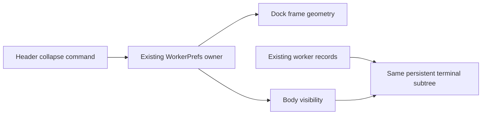

# WORKERS panel collapse (T-209 / SRC-143)

This removes the all-or-nothing header arrow and the empty workspace region
left by a panel whose body is meant to be collapsed.

The existing WorkerPrefs store owns persistent `panelCollapsed`, default false.
Its existing local setting update/load/reset path is the only writer. Runtime
worker records still own placement, minimized/active/solo identity and lifecycle.
Collapsing the panel changes no worker record, starts no process and closes no
PTY. It hides the body while preserving its mounted terminal subtree; terminals
receive visible=false. Expanding restores the same records and native sessions.
Panel collapse, minimizing one worker, hiding the panel through the footer and
closing a worker remain separate commands.

The compact header is 24 CSS pixels tall, with no resize handle or blank body.
Bottom/top docks retain their edge. Left/right docks temporarily display the
compact header at the bottom and release their entire body width; their stored
dock and expanded width remain unchanged. Expanding restores the original edge
and size. This uses one pure display-dock decision for the panel and dock frame.
Selecting a header tab or maximizing explicitly expands the panel.

No protocol or persistence version migration is needed: old settings default to
expanded, malformed flags use the same safe default. Desktop and Web share the
layout; worker runtime/remote attachment and stream delivery are unchanged.

Acceptance: two safe native workers retain PID/run markers/output/final status
while real packaged pointer clicks collapse and expand; expanded terminals are
visible, compact height and reclaimed chat area measured; all four dock edges,
stored resized geometry, single-worker minimize/restore and selected tab/split
behavior are distinct. Persisted collapsed layout survives the normal settings
reload path. The exact frozen oracle must demonstrate the pre-fix full-hide
defect and pass on a fresh packaged build; tests, types, lint and architecture
must pass. Last-worker auto-collapse belongs to separate T-200.
