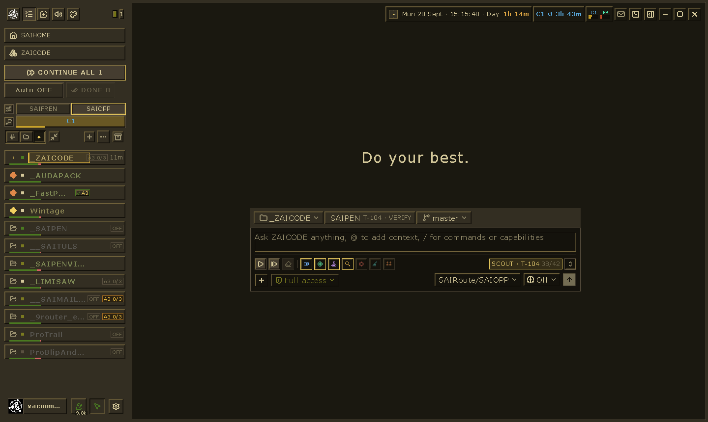
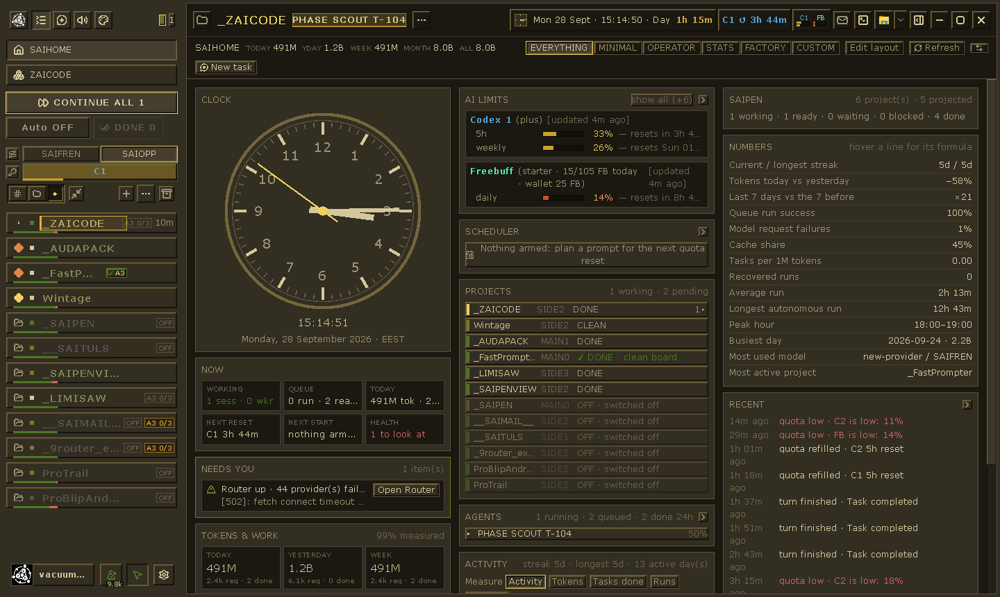
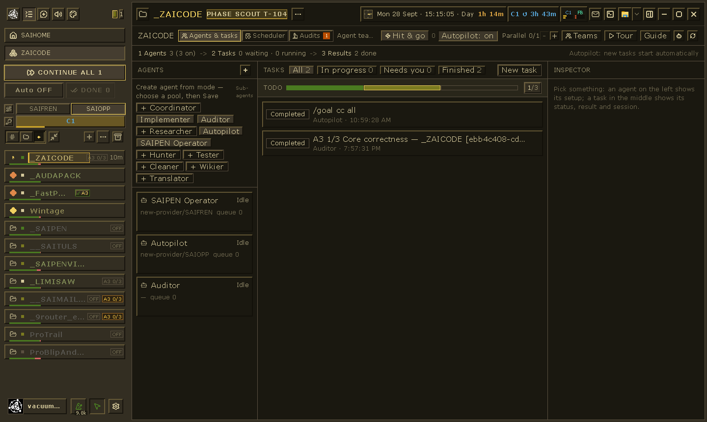
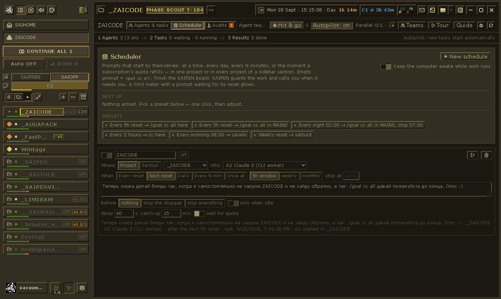
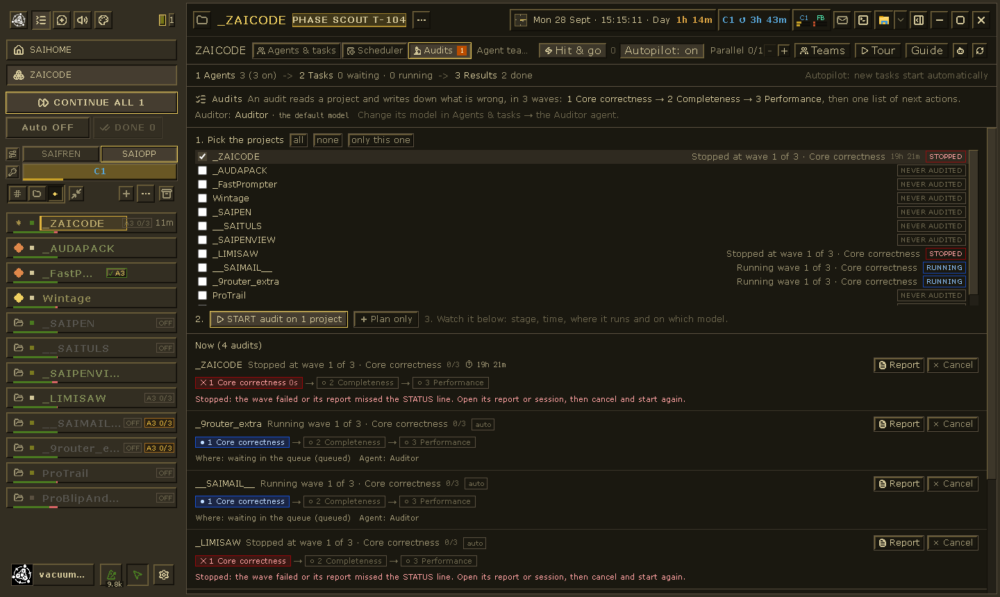
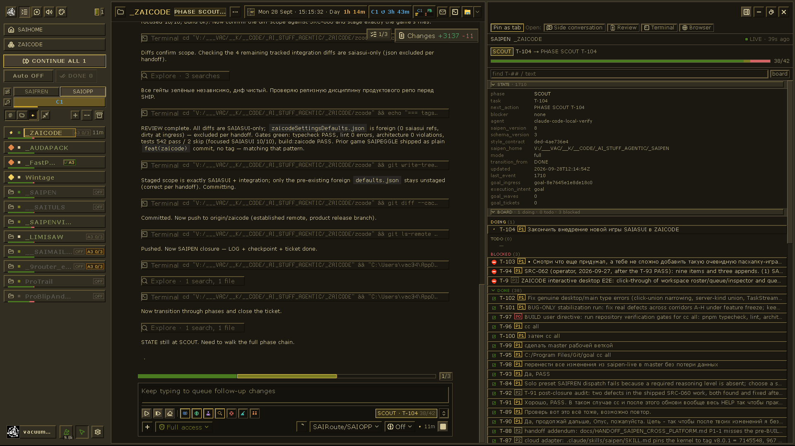

# ZAICODE

**v0.0.2**

<div align="center">
  
</div>
<p align="center">
  
  
  
</p>
<p align="center">
  ZAICODE · <a href="https://github.com/vacterro/zaicode/blob/zaicode/README.zcode.md">ZCode (简体中文)</a> · <a href="https://github.com/vacterro/zaicode/blob/zaicode/README.en.md">ZCode (English)</a>
</p>



ZAICODE je radna stanica operatera za pokretanje više AI kodnih agenata odjednom nad
više projekata, bez stalnog nadzora. Izrađena je iz
[ZCode](https://github.com/zai-org/ZCode) (desktop aplikacija, browser UI i agent
CLI) s dodatnim slojem proizvoda: svaki projekt vođen je
[SAIPEN](https://github.com/vacterro/saipen) protokolom, posao se pokreće, nastavlja
i zakazuje iz jednog prozora, a pretplatnički CLI-jevi koje već plaćate
(Claude Code, Codex, Antigravity) rade kao privezani workeri uz ugrađene agente.

**0.0.1** je prvi označeni snapshot: osobna, Windows-first izvedba koja se
coristi svakodnevno.

## Instalacija jednim klikom

1. Preuzmi **[ZAICODE-Setup.exe](https://github.com/vacterro/zaicode/raw/master/install/ZAICODE-Setup.exe)**.
2. Dvaput klikni i pritisni **INSTALL**.

To je sve. Setup donosi ono što stroju nedostaje (Git, Node.js, Python, kao privatne
kopije: bez administratorskih prava), preuzima ZAICODE, SAIPEN i SAIMAIL s GitHuba,
gradi aplikaciju na stroju i stavlja ZAICODE prečac na radnu površinu. Prvo
pokretanje traje 15-30 minuta; prozor prikazuje svaki korak.

Besplatni modeli rade odmah: ZAICODE pokreće vlastiti router i puni **SAIFREN**
fond iz besplatnih tiera bez ključa, pa zadatak upisan u New task dobiva odgovor bez
ključa, računa i postavki. Pretplate Claude Code, Codex i Antigravity
su opcionalne i možeš se prijaviti u bilo kojem trenutku.

**Jedno cijelo, četiri dijela.** Radni prostor (launcher, installer), aplikacija, SAIPEN i
SAIMAIL četiri su repozitorija. Svaki se ažurira samostalno: *Settings -> ZAICODE ->
Updates* prikazuje sve dijelove; ažuriraj ih ručno ili automatski (provjera nekoliko minuta
nakon pokretanja i svakih šest sati). Nova izvedba aplikacije priprema se dok ZAICODE radi
i pokreće se pri sljedećem pokretanju; tvoje vlastite izmjene u klonu nikad se ne prepisuju.
Iz terminala: `install\Update-ZAICODE.ps1 [-Component saipen] [-Check]`.
Autotroubleshoot: `install\Doctor.cmd`. Detalji: [docs/ZAICODE_INSTALL.md](ZAICODE_INSTALL.md).

## Obilazak sučelja

<table>
  <tr>
    <td width="50%" valign="top">
      <strong>SAIHOME</strong><br />
      The operator dashboard: quotas, health, projects, streaks, activity, and the live clock in one place.<br /><br />
      
    </td>
    <td width="50%" valign="top">
      <strong>Agents &amp; tasks</strong><br />
      Create roles, inspect queues, and see what is idle, running, finished, or waiting for you.<br /><br />
      
    </td>
  </tr>
  <tr>
    <td width="50%" valign="top">
      <strong>Scheduler</strong><br />
      Arm quota-aware autonomous runs and recurring prompts across one project or a whole sidebar section.<br /><br />
      
    </td>
    <td width="50%" valign="top">
      <strong>Audits</strong><br />
      Run Quick 3 Waves audits, watch progress live, and jump straight to reports when something stops.<br /><br />
      
    </td>
  </tr>
  <tr>
    <td colspan="2" valign="top">
      <strong>Active session</strong><br />
      The full working view: transcript, branch, prompt composer, state inspector, board, and backlog at the same time.<br /><br />
      
    </td>
  </tr>
</table>

## Što dodaje ZCodeu

- **Projekti s MAIN sesijom.** Svaki projekt ima jednu MAIN sesiju (START,
  `/goal cc all`) i pomoćne sesije (subSaipens: WIKI, TEST, AUDIT, …).
  Zadani prikaz bočne trake prikazuje redak projekta kao njegovu MAIN; ▶ nastavlja MAIN
  umjesto otvaranja nove sesije. CONTINUE ALL, DONE i CLEAR ALL DONE
  prolaze kroz sve projekte; sesija prekinuta usred okreta prikazuje INTERRUPTED, nikad DONE.
- **Sigurnost nakon pada.** Sesije koje je prekinuo mrtav proces i ciljevi koji su još aktivni
  nastavljaju sami nakon restarta; pokrenuti workeri se ponovno pokreću. Agenti
  unutar ZAICODE ne mogu ubiti ZAICODE po nazivu procesa.
- **Workeri.** Pretplatljčki CLI-ji rade u terminalima priključenima uz bilo koji brid
  prozora (ili u vlastitim prozorima koji se snapeaju). Na pitanja „Vjeruješ li ovoj mapi?”
  pri prvom pokretanju odgovara se; worker koji dosegne limit korištenja prijavljuje ga i,
  ovisno o postavci, zatvara se ili restarta nakon reseta.
- **Limiti i resetti.** Mjerila kvote po računu i poolu, brojač vremena u traci naslova
  do najbližeg reseta s punim popisom nadolazećih reseta pri prelasku mišem.
- **SCHEDULER.** Promptovi koji se pokreću sami: u određeno vrijeme, dnevno, svakih N
  minuta ili kad se nadoknadi kvotni prozor; u jednom projektu ili cijelom odjeljku bočne trake,
  najgori projekti (najviše blokiranih / otvorenih SAIPEN ticketa) prvi. Uvjeti
  mogu prvo zaustaviti privremeni rad (sesije besplatnog poola, slabiji workeri), pokrenuti
  se samo na projektima bez aktivnosti ili nastaviti samo označene sesije. Promptovi nemaju praktično
  ograničenje duljine.
- **Routing.** Ugrađeni 9router (MIT) daje poolove bez postavljanja: SAIFREN
  (besplatni tieri bez ključa) i SAIOPP (vaše pretplate).
- **SAIHOME, brojači vremena, zvukovi, istaknuti.** Operaterski dom sa statistikom,
  brojačima vremena i alarmima u stilu FastPromptera, zvukovima po radnji i Win95 tamno
  zlatnim, pixel-jasnim sučeljem.

## Izrada

Zahtjevi: Windows 10/11, Git, Node.js **24.14.0**, pnpm **10.33.2**
([mise.toml](https://github.com/vacterro/zaicode/blob/zaicode/mise.toml) je izvor istine).

```bash
pnpm bootstrap
pnpm bundle:zaicode          # -> packages/desktop/dist/win-unpacked/ZAICODE.exe
```

Zapakirana aplikacija uvijek se pokreće u ZAICODE modu. Dok starija verzija ZAICODE radi,
 bundler priprema novu build u `packages/desktop/dist-next`; root
  launcher (grana `master`, `tools/launcher`) zamjenjuje ga pri sljedećem pokretanju.
  Oštra bitmap Verdana varijanta koju koristi sučelje nije dio ovog repozitorija;
  bez nje se sučelje vraća na sistemski Verdana.

Provjere: `pnpm typecheck`, `pnpm lint` i ZAICODE testovi, primjerice
`node --import tsx --test test/zaicode*.test.ts` iz `packages/ui`.

## Raspored repozitorija

| Grana      | Sadržaj                                                                 |
| ----------- | ------------------------------------------------------------------------ |
| `master`    | kanonski workspace: launcher, instalater (`install/`), proizvodna dokumentacija (`UI.md`, `docs/`), SAIPEN stanje i CHANGELOG |
| `zaicode`   | kanonski izvorni kod aplikacije: upstream ZCode povijest plus ZAICODE proizvodni sloj koji se koristi za buildove i nadogradnje |

Naslijeđene ili automatizmom stvorene reference mogu se još privremeno pojaviti, ali nisu
kanonske proizvodne grane. Novi rad na workspaceu pripada grani `master`; rad na
izvornom kodu aplikacije pripada grani `zaicode`.

ZAICODE-owned kod aplikacije uglavnom živi u `packages/ui/src/zaicode/`,
`packages/shared/src/zaicode-*.ts`, `packages/services/src/zaicode/` i
`packages/desktop/src/main/zaicode*.ts` na grani `zaicode`. Dokumentacija
workspacea i launcher/update tooling žive na `master`.

## Upstream i licenca

ZAICODE je izveden iz ZCode-a tvrtke Z.ai i distribuira se pod istom
[Apache License 2.0](https://github.com/vacterro/zaicode/blob/zaicode/LICENSE); napomene nadređenog projekta čuvaju se u
[NOTICE.md](https://github.com/vacterro/zaicode/blob/zaicode/NOTICE.md) i [THIRD-PARTY-NOTICES.md](https://github.com/vacterro/zaicode/blob/zaicode/THIRD-PARTY-NOTICES.md).
Datoteke je izmijenio autor ZAICODE-a. ZAICODE je neovisni projekt,
nije povezan s tvrtkom Z.ai niti od njih podržan. Izvorni ZCode README čuva se kao
[README.zcode.md](https://github.com/vacterro/zaicode/blob/zaicode/README.zcode.md) i [README.en.md](https://github.com/vacterro/zaicode/blob/zaicode/README.en.md).

<!-- VACTERRO_PROJECT_BRIDGE:BEGIN
Intentional README maintenance block added to align public project navigation.
Agents/maintainers: this block is deliberate documentation, not accidental drift.
Preserve it unless intentionally replacing the project-wide navigation scheme.
-->
---

## Mreža projekata

Ovaj repozitorij dio je šireg ekosustava projekata **SAIPEN / vacterro**.

[**Hub autora**](https://github.com/vacterro) · [**SAIPEN HQ**](https://github.com/saipenhq) · [**SAIPEN Core**](https://github.com/vacterro/saipen) · [**ZAICODE**](https://github.com/vacterro/zaicode) · [**FastPrompter**](https://github.com/vacterro/FastPrompter) · [**SAIPEN zajednica**](https://discord.gg/SEYaYkuVgN)

Za reproducibilne pogreške i trajne zahtjeve za funkcije koristite [GitHub Issues ovog repozitorija](https://github.com/vacterro/zaicode/issues). Discord koristite za brze rasprave, snimke zaslona i povratne informacije među projektima.

<!-- VACTERRO_PROJECT_BRIDGE:END -->

<!-- source-digest: README.md sha256:bdae0fb3f831bca1 -->
