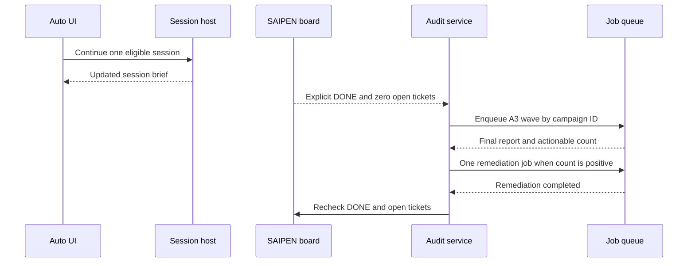

# ZAICODE feedback T-72: automatic work and preview

## Owners and boundaries

- The host owns accepted session commands and their order. The renderer sends
  one command through the existing V4 admission path; a changed task or SAIPEN
  projection is the signal to decide whether another command is needed.
- `ZaicodeSessionActionStrip` owns the window's Auto timer and its short lived
  duplicate guard. `zaicodeTurnRetryWatch` owns background retry timers for
  failed turns whose chat pane is closed. The open pane owns its own retry
  countdown. Both paths share the attempt budget for a session in that window.
- `ZaicodeAuditService` owns the durable A3 campaign, run identifier, cycle
  limit, wave queue, and remediation job. The UI mirrors its state. A campaign
  is recovered from its saved plan after an interrupted queue operation.
- The root Preview launcher owns the temporary profile and process lifetime.
  Desktop and host services receive its profile paths through environment
  variables; a Preview settings snapshot stays inside that profile.

## Event order and invariants

1. Auto considers only enabled projects and stopped sessions. A failed turn
   uses the retry watcher; ordinary continuation uses the project's existing
   host handle. A missing handle consumes no attempt. Immediately before a
   retry send, reread the session and project state. At most one submission
   per session is in flight per window.
2. A clean, terminal turn resets that session's retry budget. A new task
   `updatedAt` is part of the brief signature so a finished turn is observed
   even if polling missed its running phase. An unchanged snapshot cannot
   cause another Auto continuation; partial send failures retry only failed
   steps after the configured delay.
3. A3 starts only after SAIPEN explicitly reports DONE with zero blocked and
   open tickets, and the project has no running session or queue job. Disabled
   projects do no automatic work. The operator chooses 1–10 cycles; a new
   Auto enablement gets a new run identifier.
4. Each A3 cycle has three durable wave jobs. Its final report must state an
   actionable finding count. Zero ends the loop. Positive findings enqueue
   one implementer job keyed by campaign ID, then wait for its completion
   before the next cycle. A blocked, failed, or cancelled job stops that run.
   A saved `planned` cycle resumes only after the DONE, empty board, and
   no-running gates pass again. Each wave job has a campaign-specific title,
   allowing recovery if queue creation succeeded before the campaign save.
5. SAIFREN's scanner retains provider listing and bounded direct response
   evidence. Two valid missing listings or two explicit missing-model replies
   retire an automatically managed model. Transient failures reduce rank but
   do not remove it. Directly missing models wait 24 hours and require a
   successful direct retry before restoration. Manual order and removals are
   preserved.
6. Preview uses a fresh data directory, seeds saved UI and product settings,
   forces its settings `dataBaseDir` to that directory, and starts a completed
   staged package if present. It never swaps the daily package. On exit it
   removes the temporary profile when possible; older locked leftovers are
   swept later. A failed isolation setup aborts launch.

## Failure and acceptance scenarios

- A cold or temporarily disconnected project keeps its retry budget intact.
  A failed turn recovers in the same session without opening that project.
- Stopping Auto or disabling a project prevents later automatic sends from a
  pending timer. A successful retry followed by another failure gets a fresh
  attempt budget.
- A crash after campaign creation but before its first queue job leaves one
  planned cycle, which is resumed without creating a duplicate cycle.
- An A3 report without a valid actionable count blocks the campaign rather
  than declaring success. A completed remediation job permits the next cycle
  only after the project is again DONE with an empty board.
- Preview opens beside daily ZAICODE, shows saved appearance, and changing a
  Preview preference leaves the daily profile and source defaults intact.
  Shift-clicking its close control exits the process even with tray mode on.
