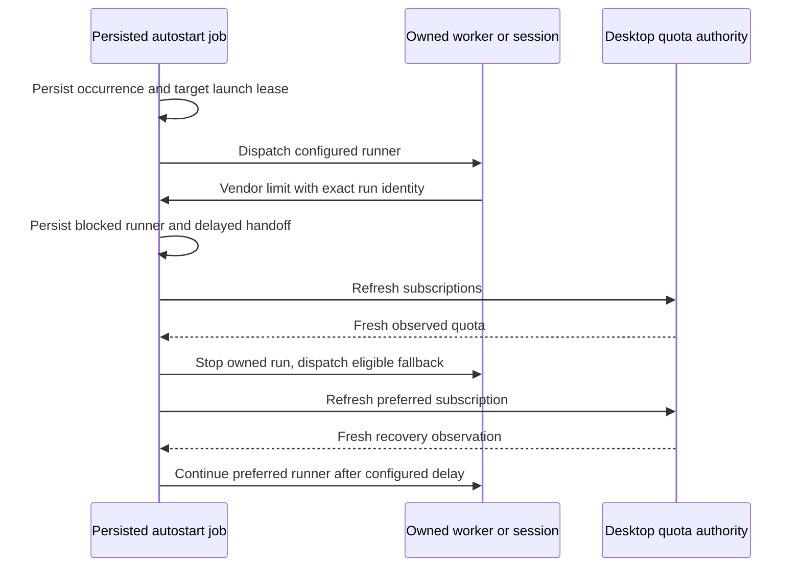

# Efficient automation and truthful navigation (SRC-129 / SRC-125)

ZAICODE implements immediately by default (the separately shipped SRC-130
change). This change addresses token use, project/session navigation, repeated
goal notices, test activity, live state, and unattended vendor continuation.

## Ownership and boundaries

The CLI conversation projection owns execution and tool lifecycle facts. Its
sessions-index derives a bounded test-command summary from running Bash tools
and background works. The existing renderer index and activity sidecar carry
that fact; project and session indicators consume it. Titles and elapsed quiet
time cannot establish execution. A completed foreground turn may still have
live background work. Runtime death invalidates local live reports for that
workspace; closing a view does not stop a live process.

Project-label clicks navigate to an existing conversation (MAIN, then the
currently open meaningful session, then the most recent meaningful session).
An explicitly empty MAIN is excluded from every fallback. Repeated clicks keep that session
open. The separate chevron folds the list; the plus starts a new session.
MAIN remains visible as an explicitly named session, including in the compact
project-as-MAIN layout. Empty projects open the composer with a clear creation
action. Upstream ZCode navigation retains its behavior.

Goal-verification control notices are renderer presentation, not history
mutation. ZAICODE hides repeated not-satisfied notices and their otherwise
empty containers; real tool errors, failed verification, successful completion,
and current progress remain visible. The existing goal summary retains counts.

The context builder/provider request projection owns prompt content and cache
breakpoints. Stable instructions and tool ordering stay stable; attachments
must retain causal order and literal user text. Cache accounting uses vendor
usage and includes cache writes, with no paid warm-up or synthetic requests.
Cache availability and hit rate belong to vendors and cannot be guaranteed.

The confirmed user-side cache defect was extension tool discovery ordering:
reversed discovery serialized a different tools prefix despite identical
schemas. Sort extension and built-in groups by code point, preserving both
groups and all schemas. The context builder already separates stable and
dynamic instructions and marks three system blocks; the provider projection
already adds the latest history breakpoint and preserves attachment causality.
Do not add a fifth Anthropic breakpoint or change accepted user text. Usage
already treats provider-normalized input as the total and cache read/write as
its breakdown; verify those paths rather than adding another accounting store.
Research: [OpenAI prompt caching](https://developers.openai.com/api/docs/guides/prompt-caching)
and [Claude tool caching](https://platform.claude.com/docs/en/agents-and-tools/tool-use/tool-use-with-prompt-caching).

The existing persisted autostart job is the sole scheduler owner. Additive
continuation policy and per-target run records remain in its existing storage.
Worker identity and generation own exact CLI execution; existing v4 commands
own in-app execution and model selection. No second scheduler or quota store.
The desktop engines service remains the authority for vendor quota snapshots.
Its currently frozen T-188 files are preserved byte for byte.

## Continuation event order

1. A due schedule records its occurrence and each target's launch identity
   before dispatch. Continuation chooses its ordered configured runners;
   subscription accounts and explicit in-app pools (including SAIFREN) are
   supported. The same project identity and objective survive handoffs.
2. A recognized, vendor-specific limit on an owned live run persists the
   account/window observation and delayed continuation before that exact run
   is stopped. Authentication, network errors, resource-limit prose and
   completed outputs do not masquerade as subscription limits.
3. After the delay, refresh quota and choose the first eligible selected
   runner. Unknown, failed, assumed or stale quota cannot clear an observed
   limit. An elapsed reset timestamp alone is not evidence of recovery.
4. Persist a launch lease before dispatch; reconcile an existing owned worker
   or session after restart. Never launch the same lease twice. A failed
   launch records a retryable result rather than consuming the project.
5. While fallback runs, periodically refresh blocked subscriptions. If the
   policy enables return and fresh quota proves recovery, wait the configured
   delay, stop only the owned fallback, and continue on the preferred runner.
   Later limits repeat this cycle. Completion ends it. Explicit schedule pause,
   stop time, project disable and Autopilot pause gate automatic dispatch.
   Recheck the latest stop time immediately before the actual worker/session
   effect: asynchronous prompt preparation must not launch beyond that deadline.

Known CLI startup trust prompts are always approved within live ZAICODE
launches. Parse the actual displayed folder/hook menu and select the trust
choice, including “Trust all and continue”. No run-age or total-answer caps.
Split output and redraws are handled; delayed input checks worker identity,
generation and terminal control again. Vendor launch flags are used only for
the vendor/version that supports them. Explicit cancellation remains effective.

## Validation

Behavior tests cover repeated project clicks, MAIN and empty projects;
foreground/background test start/end; runtime death versus quiet live work;
goal notice compaction with error/content controls; stable provider prefixes
and correct cached-token denominators; five-hour-old folder/hook trust menus,
split redraws and stale generation; vendor-specific limits, ordered fallback,
delay, fresh reset recovery, restart/launch idempotency, exact pool routing,
owned stopping and pause/disable. Exercise actual React renderers and terminal
interaction with local fixtures, plus repository typecheck/lint/architecture
and the staged desktop boot. No live paid vendor work is needed for these
deterministic checks. Package fresh CLI assets for the combined test bundle.
