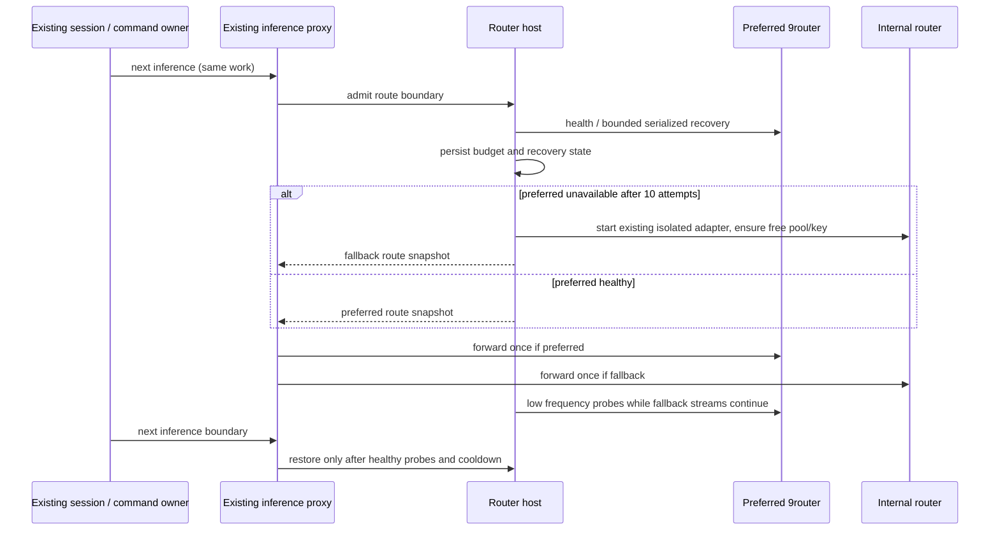

# FastPrompter continuity delta (2026-10-04, T-217)

Source: `fast_Scheduler_Continuinity_Добавить_bundle.zip`, SHA256
`67cbd64eba91bdc6cfc6f9672fc375d9e77e14644661cae9ff6eab3e2626004d`.
The portable index contains REQ-001..REQ-012 and ten screenshots. SRC-148 adds
the explicit acceptance matrix. Closed historical tickets are not acceptance.

## Ownership and integration

- Router availability and recovery belong to the existing desktop router host.
  Its process adapter performs a bounded start; it does not create a second
  unlimited recovery loop. The existing authenticated account proxy also carries
  ordinary SAIRoute inference. It selects one immutable upstream at request
  admission and retains it until the stream ends. It never replays a dispatched
  inference. Management calls continue to describe the preferred router.
- Ten serialized, persisted recovery attempts, capped exponential backoff and
  a health check after every attempt precede internal isolated SAIFREN fallback.
  Preferred probes continue at low frequency; two healthy probes plus a minimum
  fallback residence time allow restoration at the next inference boundary.
  An unusable fallback is an explicit unavailable state. Connection/API/process,
  provider/model errors and genuine quota walls remain separate classifications.
- Routing changes no project, session, objective, command, lease, scheduler job
  or pending continuation. The SAIPEN scheduler and T-190 continuation owner stay
  unchanged. The existing isolated router and free-pool setup are reused.
- MAIN identity belongs to `useZaicodeMainSessions`. Continuation retains its
  canonical session across runner leases. MAIN display hides only the canonical
  row's redundant child representation; independent user sessions remain intact.
  The retained canonical pointer is not an active in-app execution while a
  subscription worker owns the run. Missing old session briefs must not block
  worker restart/recovery. Caption safe-area variables belong to the relocated
  overlay itself, including a narrow right-side project rail.
- Retry preferences belong to `useZaicodeUiPrefs`: session override > project
  override > global default, independent of the selected editing scope. The
  single effective projection includes the existing Auto/auto-continue gate and
  emergency stop. All controls and retry owners read that projection. Scope
  changes and disabling cancel countdowns before dispatch.
- Layout placement/visibility use their existing owners. Explicit session
  activation restores the chat surface even when the session id is unchanged.
  Cleanup feedback is workspace anchored and keeps Undo.
- Generated text attachment edits replace the draft file rather than overwriting
  an already-sent file. The current draft text is inspectable and restorable.
- Worker quota meters read account/window data, retaining unknown/stale states.
  A low frequency display clock ages readings even after the worker exits;
  a frozen execution-duration clock is not evidence that a quota is still fresh.
  Presentation presets are a dimension separate from existing theme colors.

## Acceptance ledger

| Requirement | Final disposition | Executable evidence |
|---|---|---|
| REQ-001 | RECONCILED, unchanged | T-190 tests stay green in the same suite; live paid-vendor clause untouched and still carried by T-216 |
| REQ-002 | IMPLEMENTED | `desktop/test/zaicodeRouterContinuity.test.ts` (real process death, unhealthy API, attempt-four recovery with one replacement process, ten failed probes with restart persistence, quota behind a healthy router) and `zaicodeRouterSupervisor.test.ts` (bounded budget, shared recovery, restoration at a boundary, flapping, unavailable fallback) |
| REQ-003 | IMPLEMENTED | `ui/test/zaicodeContinuationEffects.test.ts` "MAIN survives repeated pool/worker replacement..."; packaged `canonicalMAIN` |
| REQ-004 | IMPLEMENTED | `ZaicodeArchiveNotice` owns one bounded workspace row above the toast layer (`z-[9999]` vs host `z-[9998]`, fixed this run); packaged `archiveUndo` asserts the notice clears the sidebar box and Undo is clickable with a toast up |
| REQ-005 | RECONCILED, verified | packaged `leftToggle`/`rightToggle`/`narrowAndRail` |
| REQ-006 | IMPLEMENTED | `ui/test/zaicodeT217Continuity.test.ts` effective-state matrix and `zaicodeT201AutoRetryScope.test.ts` override scope; packaged `retryCountdownScopeTruth` reads the notice and every control while armed |
| REQ-007 | RECONCILED, verified | packaged `pasteEditRestore` opens the exact draft text, saves a replacement and restores it into the composer |
| REQ-008 | RECONCILED, verified | packaged `currentSessionNavigation` re-selects session A after each auxiliary surface |
| REQ-009 | IMPLEMENTED | `ui/test/zaicodeT217Continuity.test.ts` worker meters over known/zero/unknown/stale/unproven-reset; meters render in `ZaicodeWorkerParts` |
| REQ-010 | IMPLEMENTED | same test keeps Classic and migrates the old bevel preference; packaged `presentation` walks simple-boxes/flat/minimal/classic and asserts no bevel |
| REQ-011 | RECONCILED, verified | packaged `collectDisabledWithText` and `collectNarrowRow` (COLLECT shares the send row's y at 640px) |
| REQ-012 | RECONCILED, verified | packaged `bothSideDirections`, `narrowAndRail`, `restartSideAndStyle` |

Gates for this delta: `pnpm typecheck` exit 0; `pnpm verify:pre-push` exit 0
(1567 tests, 0 failures, lint 165 warnings / 0 errors, architecture OK);
`pnpm bundle:zaicode` exit 0 with the packaged boot gate green; packaged UI
receipt `.saipen/evidence/T-217-ui/receipt.json` 14/14 with
`paidVendorRequests: 0`. No paid subscription exhaustion was induced.

Update dispositions only after executable evidence. Run focused regressions,
the repository full relevant suite, typecheck, lint, architecture check and
production packaging. Verify screenshot defects in the packaged/live isolated
UI. No paid subscription exhaustion is induced for this delta.
