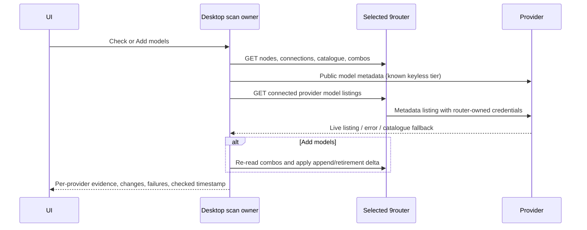

# Router model maintenance

SRC-169 R001, R002 and R007. The selected 9router owns connections, its
model catalogue and ordered combos. Desktop main admits one scan at a time;
the renderer projects its result through the existing router setup bridge.
No provider credentials leave main. Shared and internal routers use the same
transport and reconciliation rules.

`Check` reads health and model metadata only. It does not create keys,
provision providers, change combos or submit inference, completion, response,
embedding or provider test requests. The result distinguishes a live model
listing from a static catalogue fallback or a failed listing. Metadata
availability does not promise a successful generation or remaining quota.
`Add models` uses the same discovery and reconciles models without generating
tokens. Hourly maintenance uses this action and shares its in-flight run.

Discovery includes every active configured provider, custom node and native
keyless OpenCode Free (`oc`), even without a custom `zen` node or connection.
Native aliases come from the router catalogue, custom prefixes from nodes.
Disconnected providers remain visible as requiring a connection; they are
not advertised as checked. One listing per provider is sufficient when its
accounts share the catalogue; another active account is tried after a failure.
Concurrency is bounded. Native listings retain warnings and HTTP failures.
Catalogue aliases with the same routed prefix produce a single provider.
An empty native OAuth listing is unconfirmed. A listing of only one of
several accounts can add supported models, but cannot establish absence
from the other accounts. Recommendation filters never turn a model still
present in the provider listing into a dead model.

Provider-published zero input/output pricing and explicit policies of known
free catalogues determine SAIFREN additions. A random `free` suffix on an
unknown provider is insufficient. Free-first discovery appends additions at
the end, keeps the operator's current order and leaves paid models out of
SAIFREN. Supported models from other configured providers become selectable
in the router's custom model catalogue, without auto-filling SAIOPP or
changing the operator's default model.

Two distinct successful complete live listings that omit a model confirm
retirement. Static fallbacks, partial/invalid listings, authentication,
timeouts, rate limits and server errors do not confirm absence. A known free
model that becomes paid leaves SAIFREN, with the same confirmation rule.
Retirement is recorded separately from an operator removal, so a later
successful listing can revive a retired model. Explicit operator removals
stay removed. Reconciliation re-reads combos immediately before applying
deltas; stale deleted pools are not recreated by an in-flight scan. Durable
backups and atomic edit admission belong to the router recovery contract.

Acceptance: frozen original/fixed tests reproduce missing `oc/exo-free`,
discover a configured provider outside the starter list, reject an unknown
paid `free` name, retain transiently unavailable models and remove/revive
confirmed missing models. Exact request recording proves Check performs
only metadata GETs and zero inference POSTs, and changes no combos. A late
external edit retains its order and additions; deleted pools stay deleted.
Native packaged UI demonstrates visible `Check` and `Add models`, per-provider
status and an hourly scan with the same rules. Typecheck, lint, architecture,
repository tests, bundle and packaged boot precede delivery.
