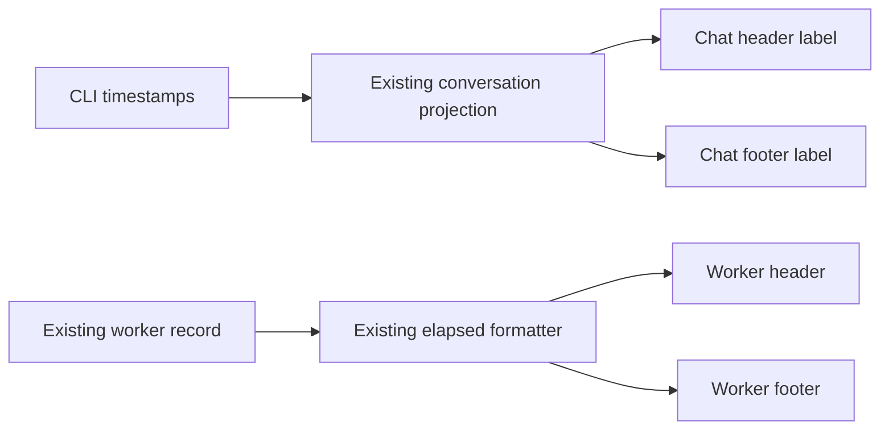

# Session duration at both ends (SRC-126 / T-191)

This change removes the need to scroll back to the beginning of a long response
or worker terminal to see how long it has worked. The operator clarified that
the surfaces are ZAICODE chat and its CLI worker terminals.

## Behavior and ownership

- Every ordinary assistant work segment keeps its existing duration/status
  header and shows the same duration/status after its last work or text row.
  The footer remains visible when work history is collapsed. Guided inputs
  retain their own segment duration rather than borrowing a different turn.
- Chat duration continues to come from the projected `workStatus`: its
  `clockStartedAt` while running and its recorded `durationMs` when completed
  or interrupted. Existing localized formatting preserves hours and days.
  Interruption retains the stopped status and displays a known duration.
- A segment without a work status gets no invented duration. Control-only
  turns retain their existing behavior. Missing recorded duration stays unknown.
- Every worker terminal shows a compact status/duration footer below its
  terminal viewport, including docked and floating placements. It reads the
  existing worker record through `zaicodeWorkerElapsedMs` and the existing
  duration formatter, matching the age in the header. The exit timestamp
  freezes the displayed duration, including nonzero exits.
- Duration is UI metadata. It never enters the transcript, clipboard response,
  terminal input, PTY output, persisted worker command, or remote protocol.

## Clock and platform boundaries

Only small duration components own display ticks; ticks do not rerender chat
rows or the terminal. Completed labels do not retain intervals. No second
persistent clock or mutable session-time store is added. Desktop continuous
updates and mobile replay both consume the existing projection timestamps;
this change does not change either delivery contract. Existing theme and UI
typography tokens apply. There is no data migration.

## Acceptance

Render the production chat turn component and worker terminal wrapper in an
isolated browser with their service/rendering leaves replaced by fixtures:

1. Running and completed work lasting over two hours is visible at both ends.
2. Clock advances update both running labels without rerendering work rows or
   remounting the terminal; completed and interrupted durations stay frozen.
3. Collapsing history preserves the end duration and the header control.
4. Guided segments retain their distinct durations; unknown and control-only
   work do not acquire a fabricated duration.
5. Worker successful and failed exits retain their final duration, and the
   footer remains visible at narrow viewport widths.
6. The original worker command is the only initial terminal input; advancing
   the duration clock never submits terminal input.

The behavioral instrument must demonstrate absent footers on the previous
product commit and pass on the changed source. Run repository typecheck,
lint, architecture and the required pre-push suite before publication.
