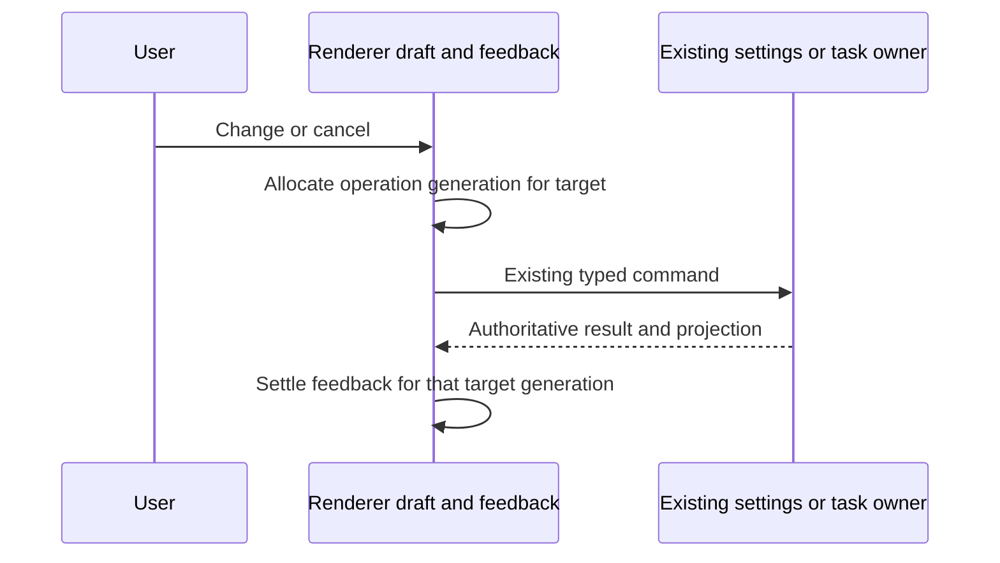

# ZAICODE workflow corrections (T-141 / SRC-107)

This work eliminates misleading subscription selection, stranded save feedback,
unresponsive task cancellation and conflicting compact controls reported in SRC-107.

## Requirements and acceptance

1. Quota auto-start considers usable primary windows, never standby reserve windows.
   Codex receives an explicit closed stdin pipe, so reading optional input cannot
   fail on Windows' null-device handle. Primary quota rows precede reserve rows.
2. Every provider/model save settles its own feedback. A later operation on another
   model or a provider draft cannot leave the earlier operation pending forever.
3. Selecting a subscription selects its available model in the selected chat;
   model, subscription and effort agree visibly. Missing configuration has a direct
   settings action. Popular connected subscriptions populate the existing provider
   catalog and SAIFREN/SAIOPP picker, respecting user visibility preferences and
   reconciling catalog additions/removals without overwriting custom names.
4. Model lists expose enable-all/disable-all and focused selection. User names persist.
5. Settings can swap the workspace and utility sidebars.
6. Dragging the workspace sidebar to its minimum reveals a compact vertical rail.
7. Cancel task reaches the existing task/runtime owner and reports actual completion
   or failure; it must not merely remove a renderer row.
8. Old unfinished audits can be cleared conveniently without cancelling live runs
   or deleting their project files silently.
9. Pin, audit and neighboring controls retain separate hit targets at narrow widths.
10. Repeat UI sound events overlap or replay immediately according to the chosen
    sound mode. Hover entry must not be throttled into a single audible event.
11. Keyboard Shortcuts and Hotkeys share one settings destination with discoverable
    app and ZAICODE controls; old navigation identifiers remain routable.

## Ownership and event ordering

Quota facts remain in the desktop engines snapshot; shared quota functions derive
eligibility and display order. Renderer views do not retain another quota cache.
Provider settings remain authoritative in the existing provider settings service;
drafts are local intent, and feedback generations are keyed by operation target.
Model display names are optional metadata in that same model configuration, persisted
by the existing atomic draft command. They never rename the transport model ID, so
subscription reconciliation retains the alias while still retiring removed IDs.
Sidebar choices send one ephemeral command to the focused composer of the current
workspace; only that composer updates its existing submission intent. Defaults for
new chats retain the chosen effort. Hidden panes do not consume sidebar commands.

An older completion for the same target cannot replace newer feedback. A completion
for a different target must still settle independently. Desktop continuous and
mobile replayable task delivery retain the same owner and existing transport.

## Verification

Focused runtime and UI regressions must cover each requirement, followed by
`pnpm typecheck`, `pnpm lint`, `pnpm verify:pre-push`, and a staged desktop build.
Unexecuted desktop interaction checks remain explicitly unverified.
Existing locale/game changes from T-140/T-139 must be preserved and published with
their original evidence; this ticket cannot claim their implementation as new work.
