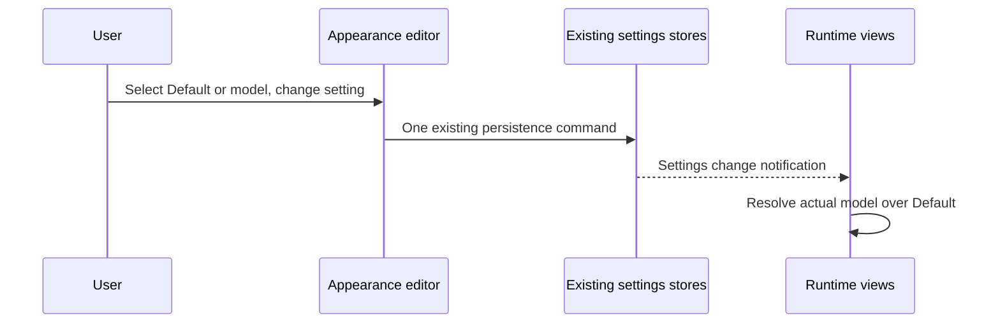

# Visible sidebar state and model appearance (T-142 / SRC-108)

This change eliminates disappearing folders, zero collapsed-slot counts,
invisible project selection, disconnected model appearance settings, fractional
text positioning and forced fresh-session START commands.

## Behavior and ownership

- Slot headers count their original project list before hiding rows. Collapsed
  slots show their count even if expanded counts were disabled.
- Every created folder is immediately visible in a compact folder strip above
  slots, including empty folders. Folder membership and collapse remain owned
  by the existing project organization store. Projects remain in their slots;
  folder headers list counts and a project menu moves membership without disk IO.
- The active project receives a persistent two-pixel inset border on the whole
  project row, independent of session selection, hover, working highlights and
  idle dimming. Workspace identity participates in the selection comparison.
- Working icon settings start with Default and provider-qualified model tabs.
  The selected tab edits the existing complete icon/motion/color/layer editor
  and complete highlight controls. Editing a model enables its own appearance;
  Use Default removes its override. Preview and every runtime mark use the
  same resolver and the model that actually executed the work.
- Existing model icon/color choices survive. Missing model fields inherit the
  current global settings; highlight rules merge by field within each target.
  No second settings writer or motion vocabulary is introduced.
- Pixel snapping corrects parent/child positions in the same frame, observes
  layout and DOM changes promptly and releases corrections when uninstalled.
  Text-bearing columns retain natural layout rather than a composited transform.
- START retains its fresh MAIN behavior. Shift+START sends `/goal cc all` through
  the current composer, without changing an existing MAIN or invoking a worker
  engine. Compact and full buttons advertise the modifier and behave identically.

## Acceptance

Regressions cover collapsed counts, empty/collapsed folder visibility, model
inheritance including legacy assets and per-target merging, full editor round
trips, nested fractional layout and Shift+START dispatch. Browser interactions
exercise tabs, persistence, folders and both START layouts. Run repository
typecheck, lint, architecture check and pre-push suite; build the desktop app
and record any runtime limitation without claiming unobserved rendering.
