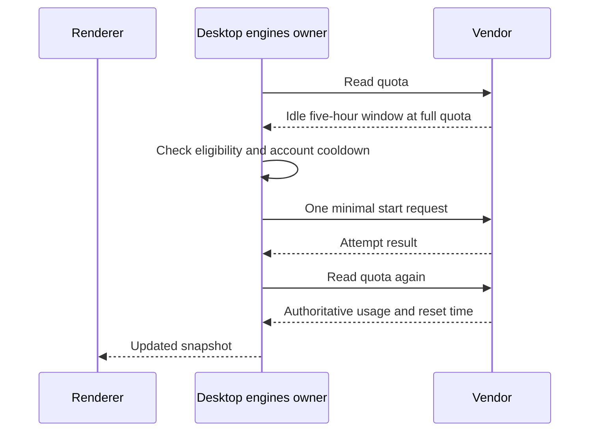

# ZAICODE reasoning, rolling windows, and folder confirmation (T-143)

## Product behavior

- In ZAICODE product mode, a model with no declared reasoning control exposes no Thought control. A model whose only meaningful choice is a binary disabled/enabled pair always uses the declared enabled value. The binary control is absent from the composer and other option pickers. Explicit graded levels remain selectable. Ordinary ZCode mode retains its existing choice.
- A saved binary disabled selection is interpreted as enabled for future requests. Session history and already issued requests are not rewritten.
- Ready, visible subscription accounts with an idle five-hour window may start it automatically when `keepWindowsRolling` is enabled. This includes Claude, Codex, Antigravity, and the ZCode Coding Plan. A spent longer window, a reserve pool, a failed quota read, a hidden account, or a recent attempt prevents a new start.
- Antigravity starts through one sandboxed, low-effort headless CLI request. ZCode starts through its configured Coding Plan key and the coding-only API endpoint, never the general prepaid endpoint. ZCode quota reading and window start require no developer CLI or global Node. Both use the smallest practical prompt/output and run once per eligible account and cooldown. The next quota read provides the vendor reset time; a successful model completion plus a reset anchored to the attempt marks a rounded 100% window as running. A transport response without a model completion is a failed attempt.
- A model request necessarily uses tokens. Exact zero consumption cannot be promised by the client. The UI must not synthesize a running reset or a zero usage figure before the vendor reports it.
- Folder deletion confirmation keeps its title, description, and both actions within the dialog at narrow widths and with translated or long labels. Folder deletion still retains projects and files.

## Ownership and event order

The provider registry owns model option specs and effective selection. The shared binary reasoning rule is consumed by the registry and option picker; no second saved preference is added. The desktop engines service owns quota snapshots and auto-start attempts. Renderers derive countdowns from those snapshots. The existing confirmation host owns dialog layout.

Concurrent starts for the same account coalesce. Failed attempts retain their error and retry only after the configured delay. Restart reads the persisted attempt record. No request is made with a general prepaid API key or to an unrecognized host.

## Acceptance

- Binary off/on options disappear and execution chooses on, including legacy saved off; graded options still work.
- Antigravity and ZCode eligibility, request shape, accepted/refused responses, cooldown, and vendor reread are covered by focused tests.
- A narrow rendered folder confirmation retains all text and actions within its dialog.
- UI interaction checks, typecheck, lint, architecture check, and relevant product tests run without weakening existing gates.
