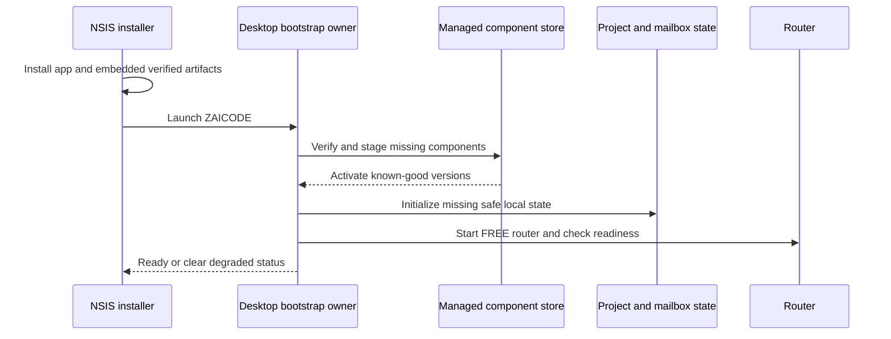

# ZAICODE one-click Windows release (T-144)

## User contract and release boundary

The primary Windows download is one NSIS `ZAICODE-Setup-<version>.exe`. It installs
the desktop app, its existing bundled agent and native tools, the pinned
9router_extra server, a private Python runtime, the managed SAIPEN protocol and
SAIMAIL local CLI. A user needs no Git, GitHub CLI, Node, pnpm, Python, shell
setup or source checkout. Existing development checkout scripts remain operator
tools and are not an update source for a production installation.

The installer can complete offline because all required runtime artifacts are
inside it. First launch validates its embedded manifest, installs missing
managed components, initializes a durable local SAIMAIL mailbox and starts the
existing FREE router path. SAIPEN implementation is separate from each
project's `.saipen` machine state; opening a compatible project can initialize
missing state without replacing an existing `.saipen` directory.

## Ownership and paths

- NSIS owns immutable application binaries under the selected per-user program
  directory. Electron owns its established `%APPDATA%/ZAICODE` user data.
- The desktop managed-component owner installs versioned implementation and
  private Python files under `%LOCALAPPDATA%/ZAICODE/components`, stages updates
  under `%LOCALAPPDATA%/ZAICODE/update-staging`, and logs under
  `%LOCALAPPDATA%/ZAICODE/logs`. No durable state is under `%TEMP%`.
- SAIMAIL owns keys, quarantine, trust and message state in the app's durable
  mailbox directory. SAIPEN owns `.saipen` in each project. The router keeps its
  durable data in the existing Electron user-data router directory.
- The desktop main process owns bootstrap and status; the UI only presents the
  state and requests explicit operations. Concurrent first launches share one
  bootstrap and repeated launches do not recreate identities.

## Trusted release channel

The stable manifest identifies each component, version, release channel,
trusted URL, expected size and SHA-256. It is published with explicitly
promoted release artifacts, never derived from branch HEAD at the client.
The installer embeds a checked manifest and component artifacts. An update
downloads into staging, verifies bytes before activation, keeps the current
version on failure, and retains a known-good version for rollback. The desktop
app uses its existing electron-updater checksum path only when the manifest
names an approved stable release. Signature support is recorded separately
unless a real signing key and verification gate are present.

## Acceptance and stop rules

Use a clean Windows VM, Sandbox or dedicated fresh profile with no ZAICODE,
SAIPEN, SAIMAIL, router config or developer tools. From the single installer,
prove install, launch, project, task, real FREE answer, SAIPEN status, SAIMAIL
identity, restart, upgrade, uninstall/reinstall and state preservation. Also
prove a controlled A-to-B update, deliberate hash mismatch rejection, offline
launch/check, unavailable peer and router restart. Record exact artifact hash,
size, versions and publication location. A local unpacked build or an existing
developer profile cannot satisfy this acceptance. Publish stable only after all
product gates pass; otherwise report `NOT_READY_FOR_NEW_USERS` with exact
blockers and retain engineering artifacts.
