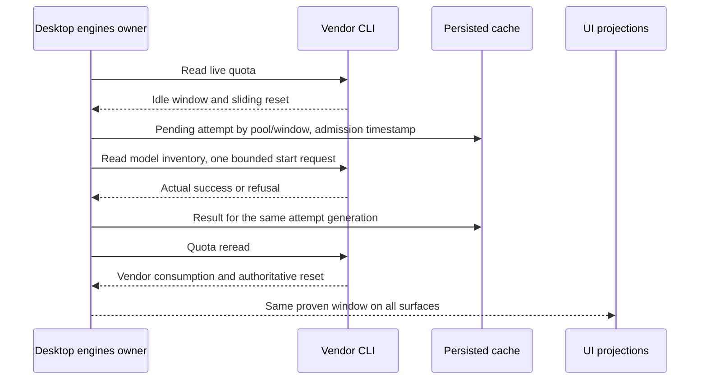

# Real idle-window starts (T-188 / SRC-116 C2-C5)

Defect: a local `rollingFrom` is created before starter admission, so every
Antigravity idle window fails the waiting-for-first-use predicate. A countdown
survives sweeps and restart while the actual start never runs. The pinned Flash
3.5 model is also absent from the installed CLI's advertised inventory.

The desktop engines service remains the only quota/attempt owner. Shared pure
rules classify vendor windows and admit starts; UI surfaces consume the same
snapshot. No renderer queue or authentication store is added.

- An idle vendor reset (`read time + duration`, full quota) stays unstarted until
  there is a matching successful attempt and a vendor reset anchored to it.
  A failed, pending, unrelated-pool, expired or absent attempt supplies no live
  countdown. Historical synthetic anchors cannot supply that evidence.
- Real consumed windows retain their vendor quota and reset. A rounded full
  window can retain a real attempt anchor when its vendor reset proves the start.
  Neither failed reads nor process restart discard recorded attempts.
- The account-level message says that the start request was accepted, rather than
  claiming the vendor window is running before its quota reread proves that.
  Request details name Antigravity generically, since either pool can be targeted.
- Persist attempts by window key, retaining the latest account-level record for
  existing UI consumers. A single request starts the eligible windows in its
  vendor pool; another pool retains its own admission and retry history.
  Successful starts remain admitted for the window duration. Failures/pending
  interrupted attempts wait the existing one-hour retry interval.
- Persist a pending attempt before invoking the vendor, then update only that
  attempt generation. One in-flight start per account; no repeated model traffic
  on each sweep. Prefer the shortest eligible window.
- Antigravity chooses a currently advertised low-effort Flash model for Gemini,
  and an advertised GPT-OSS or low-effort Sonnet model for the Claude/GPT pool.
  Unknown pools or unavailable inventory produce an explicit unsupported/failed
  attempt, with no invented model or successful countdown.
  The explicit effort must match the advertised model variant: the installed
  GPT-OSS model supports `medium` and rejects a conflicting `low` flag.
- Existing minimal prompts, sandbox, deadlines, vendor-owned credential vault,
  Coding Plan endpoint allowlist and account visibility rules remain in force.
  No OAuth material is copied, logged, swapped or exported.
- Mobile and desktop render the same host snapshot. This changes no accepted
  task queue, lease, stream delivery or replay semantics. Legacy cache records
  remain readable; unproven local anchors are removed on the next live read.

Acceptance: unchanged regression instruments run against the old and repaired
subjects. Domain tests reject synthetic/failed/foreign/expired anchors and prove
independent pool admission, persisted retries and model selection. Packaged live
acceptance uses an isolated application profile with the existing OS credential
vault, proves an actual minimal starter, repeats vendor sweeps, restarts the app,
and checks SAIHOME/topbar against the same reset. Full repository gates, production
build and packaged boot are required before publication.
