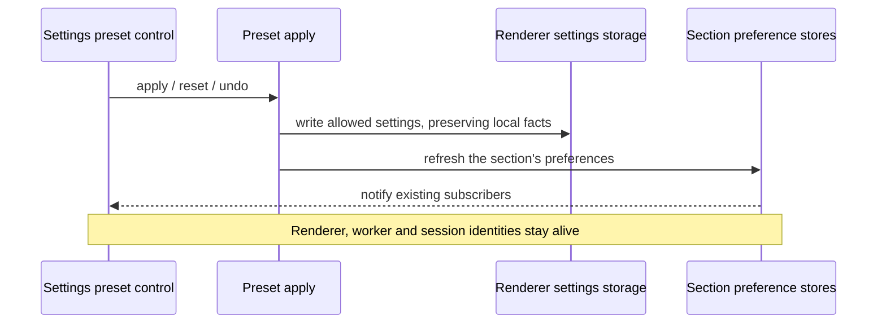

# Live Settings presets (T-208 / SRC-142)

Defect: applying a preset outside Sounds reloads the renderer, interrupting
workers, session attachment, the selected project and unsent drafts. A startup
timer loader also resets live countdowns when reused for a settings refresh.

## Behavior and ownership

All ten Settings preset sections apply, reset and undo in the current renderer.
The preset environment cannot reload the window, restart Electron or queue a
restart. Each existing preference store remains its sole owner; the preset
section dispatcher re-reads those stores through their existing public hooks.
Task notification preferences notify the existing StoreProvider; its two cached
flags update together without rewriting storage or recreating the store. Hotkeys
presets remain available on the merged Keyboard Shortcuts page in ZAICODE mode.
Highlights/motion, Session text, SAIASUI and team presets retain their existing
store command paths and must also keep the active runtime intact.

Workers and runtime sessions stay with their existing process/registry owners.
No preset operation changes their identity, accepted task, result attachment,
selection or composer draft. Preference changes may update an existing view or
a bounded subsystem; they cannot restart the application or its runtime.

Timer presets carry clock, temporary-timer template and productivity preferences.
Alarm/calendar identities, interval schedules and firing history, missed alarms,
productivity state/phase/remaining time/completed cycles/pending alarm are local
facts. Applying, resetting or undoing preferences preserves those live facts.
An active temporary timer follows template appearance/sound changes through
the existing setter while keeping its identity and deadline. An idle productivity
timer takes the new phase duration; a running, paused or ringing one keeps its
remaining time and alarm state.

## Failure and migration boundary

Existing allowlists, asset restoration, undo and storage-write rollback remain
the preset apply path. A failed settings write reports the existing error and
does not refresh the view. There is no reload fallback if refresh fails.
Existing saved presets continue to load; runtime fields embedded in older
timer presets are excluded on capture/compare/apply just like other local facts.
The legacy reopen-marker reader may consume old markers but new preset applies
cannot create one or reload the renderer.

## Acceptance

- A frozen regression rejects the previous Colors/other-section reload path.
- Apply/reset/undo timer preferences during running, paused and ringing states;
  preserve exact live run state, remaining time, cycles, alarms and schedules.
- Exercise every registered preset family against its real refresh dispatcher.
- In an isolated packaged Electron profile, apply several preset families with
  a safe worker active; observe unchanged application/renderer/runtime identity,
  continued worker output and attached final result, selection and draft retained.
- Existing preset asset/import/undo tests, focused regressions, full required
  typecheck, lint and architecture checks pass. Preserve unrelated T-188 changes.
