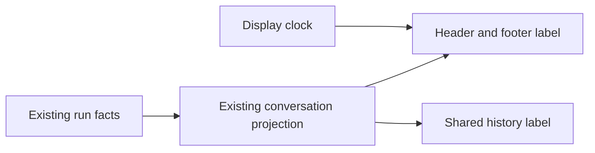

# Known work duration (T-210 / SRC-144)

This removes empty `Working for` labels and durations derived from invalid
timestamps in conversation headers, footers and shared history.

The existing conversation projection owns active/completed/interrupted truth.
The label clock only advances an established projected start; mounting,
restoring, detaching or restarting a renderer never creates a start timestamp.
Positive finite timestamps and nonnegative finite recorded durations are valid.
Future or missing starts produce no derived duration. A very recent known start
retains the existing localized minimum-second format. Recorded active durations
remain authoritative even when their start timestamp is absent.

An active segment with unknown time says localized `Working`; a known time says
localized `Working for {duration}`. Completed and interrupted segments retain
their existing terminal labels and never say `Working`. The shared surface uses
the same duration validation and neutral running-label decision. Neutral wording
reuses each locale's existing plain `chat.toolCall.nodeRepl.processing` message;
all supported locales, including DED, retain parity without adding catalog keys.

Desktop continuous and mobile replay consume the same projected facts. There
is no persistence migration, protocol change, lifecycle change or second timer.
The sidebar's separate observed-streak contract is outside this defect.

Acceptance covers normal and very fresh runs, restored/restarted runs, detached
active work, absent/zero/negative/non-finite/future starts, recorded durations,
terminal work and control-only turns. A frozen browser oracle must fail on the
previous product commit and pass on the fix. Re-run the unmodified T-191
multi-hour/footer/lifecycle oracle, locale parity, typecheck, lint and architecture.
