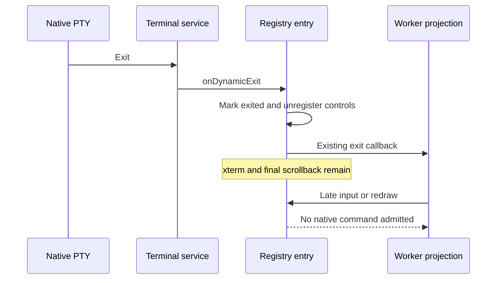

# Persistent terminal input after exit (T-212)

`TerminalSession` keeps a worker's xterm and input subscriptions in the existing
side-pane terminal registry across layout changes. Native PTY exit removes the
host terminal, but previously left those subscriptions and public controls live.
Late terminal replies, typing, or delayed IME input consequently rejected with
`Terminal not found` while final worker output remained visible.

The registry entry owns the terminal's exited fact. Native exit marks that same
entry exited and unregisters its controls before notifying the worker's existing
exit owner. Input admission checks both the current entry identity and its native
terminal identity. Exit and explicit release fence xterm input, captured controls,
delayed IME input, pending initial-input acknowledgements, and delayed redraws.
Detach and reattach preserve live input; they do not imply exit.

The injected terminal service remains the only native boundary; its unknown-ID
errors remain strict. A write already admitted before a remote/native exit may
reject; the renderer logs that recoverable failure instead of producing an
unhandled promise. There is no retry, new terminal, duplicated worker state,
profile migration, or change to ordinary terminal ownership.

Acceptance uses the actual component with deterministic terminal/service ports,
plus a packaged Electron worker that naturally exits and retains its final output.
Live input, detach/reattach, exit ordering, captured controls and delayed IME input
are covered. The same frozen acceptance must fail before and pass after the fix.
The parked T-209 collapse implementation and oracle remain unchanged.
