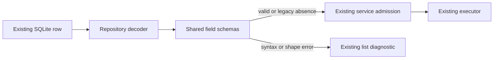

# Nested ZAICODE persistence validation

The agent and job repositories own decoding their SQLite rows. The existing
shared schemas own the accepted field shapes; services continue to admit runs
only from validated definitions and jobs. Both repositories use one internal
persisted-JSON reader so syntax and schema errors have the same meaning.

For `tool_policy_json`, `model_selection`, `delegation_json` and
`actual_model_selection`, a non-empty stored value must parse as JSON and match
its field schema. Otherwise the row is returned in the existing diagnostic
collection (`invalid-definition` or `invalid-job`), with its id and the column
name. It is excluded from usable rows and `get` returns null. A job referencing
an invalid agent becomes blocked before invoking the executor; an invalid job
cannot be dispatched. The reader never rewrites or deletes the damaged bytes.

SQL NULL and the legacy zero-length string retain their existing absence
semantics. An absent tool policy and an explicitly valid `{}` produce an empty
policy. Whitespace-only strings, JSON null, arrays, invalid enum values and
wrong property types are damaged values, never defaults. Valid policies,
model references and delegation metadata round-trip through the same schemas.

No migration, alternate persistence writer, runtime permission default or
desktop/mobile delivery contract changes. Existing damaged rows remain on disk
for explicit repair; reading them cannot broaden their execution policy.

Acceptance uses temporary SQLite databases and covers syntax and schema errors
in each exact column, visible diagnostics, unchanged stored bytes, blocked
execution, absence compatibility and valid round-trips. Replacing either
repository decoder with its previous version must turn its regressions red.
