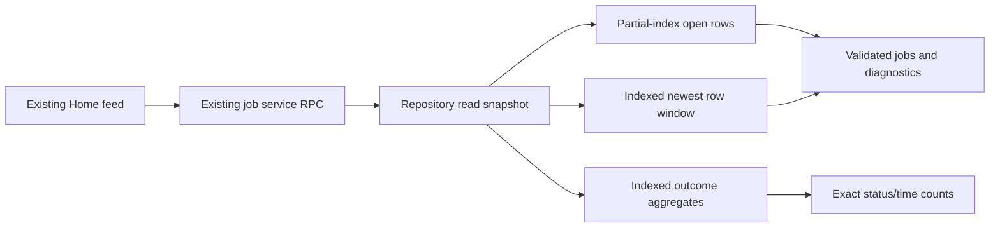

# Bounded SAIHOME queue overview

SAIHOME currently transfers and decodes every durable job on each refresh so
it can count live/today outcomes and list active fleet jobs. Limiting that
array alone makes the counters wrong. The existing job repository owns a
single consistent read snapshot; the existing job service exposes it through
one typed `getHomeOverview(dayStart, recentLimit?)` RPC.

The snapshot returns every nonterminal job plus the newest 20 rows by default
(caller limit clamped to 1..200), existing diagnostics for those selected rows,
the six queue counts, completed-last-24-hours count, caller dayStart and host
capturedAt. Results have stable createdAt/sortOrder/id ordering. Native counts
read durable status/time facts directly; damaged descriptive metadata cannot
erase historical outcomes and remains diagnostic on selected rows. Historical
terminal rows outside the bounded window are never decoded into jobs.

The six counts preserve healthy-row behavior: running; queued/ready;
waiting/draft; blocked; completed since local midnight; failed since local
midnight. Completed-last-24-hours uses the original strict rolling boundary.
Live and outcome queries share the same read transaction with the job window,
without asynchronous work inside it. Old list/filter behavior is retained.

Migration 0009 adds only a global created/sort/id ordering index and a
status/finished-time index. Released schema/migration checksums are unchanged.
The existing partial open index bounds nonterminal work. Rollback is restoring
this Work's owned code; the additive indexes contain no user data and do not
require destructive cleanup to revert behavior.

The service validates finite dayStart within the last 26 hours (covering local
midnight across DST), and owns capturedAt/rolling-cutoff time. UI sends its
local midnight, reads the snapshot counts directly and keeps active fleet
details. NOW uses the queue snapshot for completed/failed-today facts; tokens
and runtime remain event statistics. A delayed historical ingestion cannot
make NOW show zero completions when the queue already has today's results.
Outcome timestamps must be finite numbers: SQLite's permissive typing must
not turn text/blob/infinite corruption into a positive day or rolling count.
Day rollover refreshes through the same existing feed path; stale
day counts are unavailable until refreshed. No second cache/timer/store or
unbounded compatibility fallback is added.

Example: with 500,000 old completed jobs, three live jobs and 12 completions
today, the counters include all three and all 12 while at most 20 recent rows
plus the live set are decoded. Older jobs remain directly addressable by id.
All-zero counts on an empty healthy database are valid; unavailable data is
represented by the existing feed error/null surface.

Acceptance compares normal counts against the old full-list algorithm,
checks oldest live survival, rolling/local-day boundaries, deterministic
ordering, malformed-row diagnostics, atomic read consistency and exact query
plans/decoded row counts. Preserve an unfixed API seam using the actual old
full read for same-oracle controls. Run real 100k/500k SQLite probes, repository
gates and 60 seconds of instrumented refresh/RPC/render activity in a packaged
current build. No GUI or performance verdict is inferred from unit tests.
