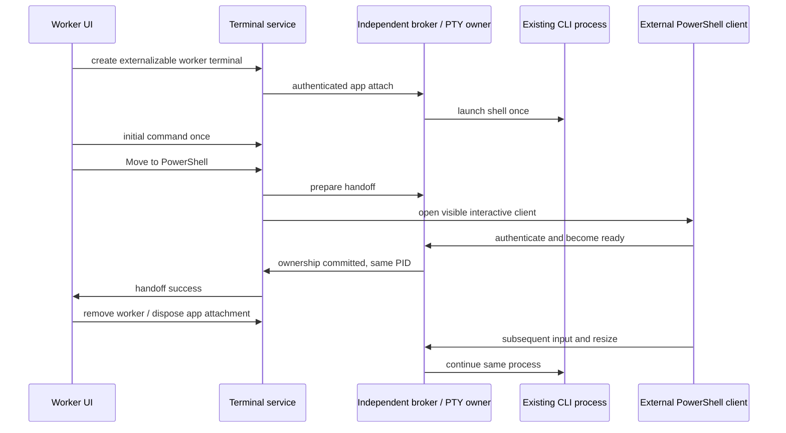

# Move a running CLI worker to PowerShell (SRC-127 / T-192)

The current host owns each worker's ConPTY and kills it when disposing local
services. Opening another shell with the original command would duplicate the
CLI and lose its in-memory work. This change transfers interactive ownership
of the existing process to an external Windows PowerShell window.

## Ownership and user behavior

- Windows subscription workers start with an independent terminal broker as
  their PTY owner. The existing terminal service projects its output and sends
  input/resize commands; it remains the only renderer-facing service.
  Ordinary terminals and other operating systems retain their existing owner.
- A live worker offers **Move to PowerShell** in its context menu once its
  terminal has advertised this capability. The external window attaches to the
  same PTY and CLI process; the original command is never launched again.
- The broker admits one controlling connection. External readiness commits
  the one-way ownership transfer. Only then does ZAICODE remove its worker
  presentation and clean up its renderer/service connection, without killing
  the PTY. The external window and original CLI keep working across a normal
  ZAICODE quit/restart, including a forced loss of the original host.
- Closing the external terminal stops its own PTY, as closing an ordinary
  PowerShell terminal would. Extracted workers are absent from ZAICODE's
  running-worker/quit/crash-relaunch projections; restart does not duplicate them.
- A failed external launch/readiness check leaves the original worker inside
  ZAICODE with its process and input owner intact. Repeated concurrent clicks
  share one handoff attempt; an already committed transfer cannot be repeated.
- An exited worker, a terminal without the capability, or an original start
  command not yet sent rejects handoff honestly. No process injection or
  unproved retroactive transfer of a pre-upgrade host-owned ConPTY is attempted.
  After installing this feature, a worker started inside ZAICODE is already
  broker-owned before it begins work and can subsequently be moved live.

## Contracts and boundaries

`ITerminalService.create` accepts an optional worker externalization request and
returns a capability only when the broker is available. The service's optional
`extractToPowerShell` operation returns the unchanged shell PID on successful
transfer. The UI uses its injected terminal service through its existing
terminal-control registry; it never calls a native bridge directly.

The local broker protocol is strictly validated, newline-delimited JSON on a
per-worker local pipe. A random per-worker capability authenticates connections.
It permits only app/external attachment, terminal input, resize, preparation,
abort and stop. No unauthenticated message controls the process. Configuration
contains local process metadata and the random capability, not inherited
credential-bearing environment values. Environment passes through ordinary
process inheritance. Local file/network IO is asynchronous and bounded.

The broker starts through a short-lived hidden Windows launcher and is no
longer descended from a live ZAICODE host process when creation completes.
Its PTY uses the existing bundled ConPTY DLL: the system implementation drops
non-BMP input in the PowerShell command reader, including before handoff, while
the bundled implementation preserves it. After its worker finishes, the broker
flushes and closes its pipe peers and server, removes its local configuration,
and exits its own process so the DLL reader thread cannot keep that owner alive.
The interactive external PowerShell window is visible because the operator
explicitly requested it. Broker/client code is a shipped runtime entrypoint,
also resolvable from the source tree for native verification; no new dependency.

The external client uses PowerShell's real console and system .NET assemblies
to attach to the broker pipe. The packaged GUI Electron executable does not
inherit interactive console stdio under PowerShell, so it is used for the
broker, never for the external console client. Raw UTF-8 input, terminal output,
resize and exit status follow the same wire contract in source and packaged
runtimes. Only this client path is shipped.
The console payload is encoded once for the visible PowerShell. The short-lived
launcher receives its bounded script through a direct `-Command` argument;
encoding a launcher that already contains the console's encoded payload exceeds
the Windows process command-line limit and prevents a packaged handoff.
The packaged worker factory is also a runtime entrypoint, so acceptance loads
the packaged factory and broker directly instead of mixing source-side client
code with a packaged server.

Before readiness the app owns input and lifecycle. After readiness the external
client owns them. Generation/terminal identity and live ownership are checked
on every operation; a late callback cannot remove a newer worker. Losing the
app before any transfer cleans up its broker/PTY. Losing it after transfer
retains the external owner. Unhandled protocol, launch or native failures are
truthful errors, never a success receipt. Output replay is a bounded projection.
This local Windows feature does not change desktop/mobile conversation delivery.

## Acceptance

1. A real Windows PTY runs a harmless long-lived CLI fixture with a monotonic
   counter and known PID. Transfer it while running, terminate the app-side
   attachment/host, then interact through the external client. PID and counter
   continuity prove no restart or duplicate CLI.
2. Exercise input/output, resize, nonzero exit, ordinary close, app crash before
   extraction, failed external startup, simultaneous requests, invalid auth and
   stale app input after ownership transfer. Every owned test process is cleaned.
3. Render the actual worker context menu/control path with an injected service;
   assert one extraction, removal after success, retention on failure, missing
   capability/exit/startup guards and unchanged initial command.
4. Demonstrate the previous host-owned worker dies at host disposal as the RED
   control. Pin the final native/UI instruments for the changed subject.
5. Run repository typecheck/lint/architecture/tests, production build and an
   isolated packaged runtime proof. Never restart or kill the operator app or
   its live workers for acceptance.

The packaged boot profile must set `keepWindowsRolling: false` before launching
the app. It must verify that this configuration belongs to the launched test
profile. Windows credential storage is shared across profiles, so changing
`HOME` alone cannot isolate automatic vendor window starts. Operator defaults
and the live profile remain unchanged.

Windows reference: [Creating a pseudoconsole session](https://learn.microsoft.com/en-us/windows/console/creating-a-pseudoconsole-session).
ConPTY and its communication channels precede process creation, so ownership
must be arranged at worker startup. The broker is the chosen implementation;
the Microsoft document does not itself promise cross-host transfer.

Natural exit may overlap an external console resize. Node-pty can know the OS
process has exited before publishing its buffered-output `onExit` event. Its
specific already-exited resize error is a normal shutdown race, so the broker
retains the pipe until the original exit event is delivered. Other resize and
protocol errors remain failures. No guessed exit code or delay repairs the
display; the original PTY exit event remains authoritative.
